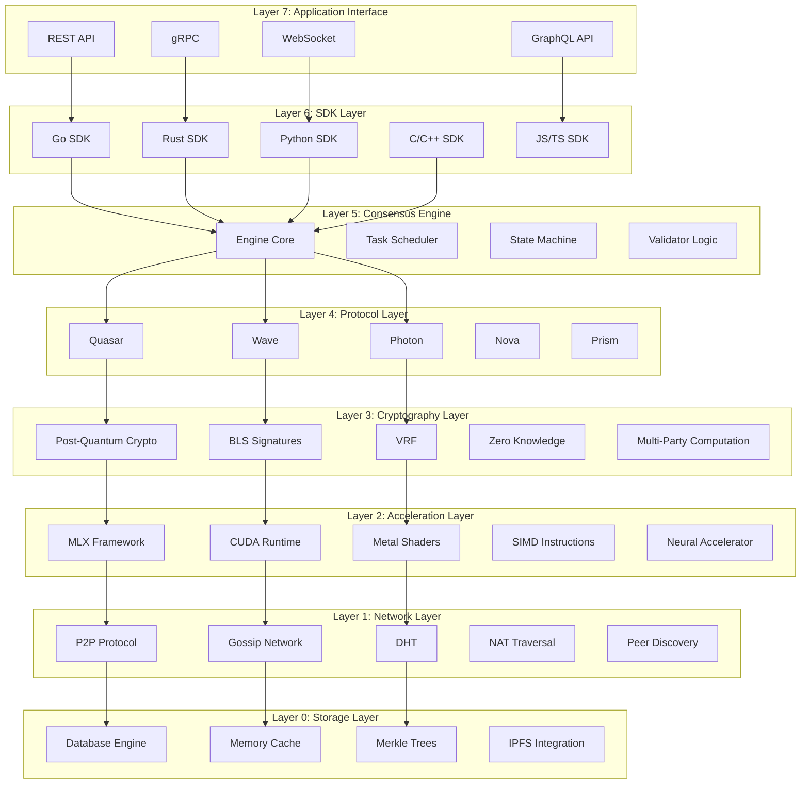
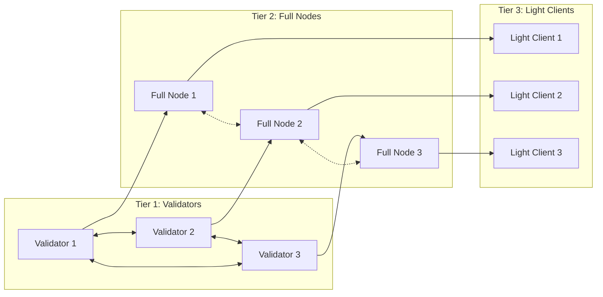
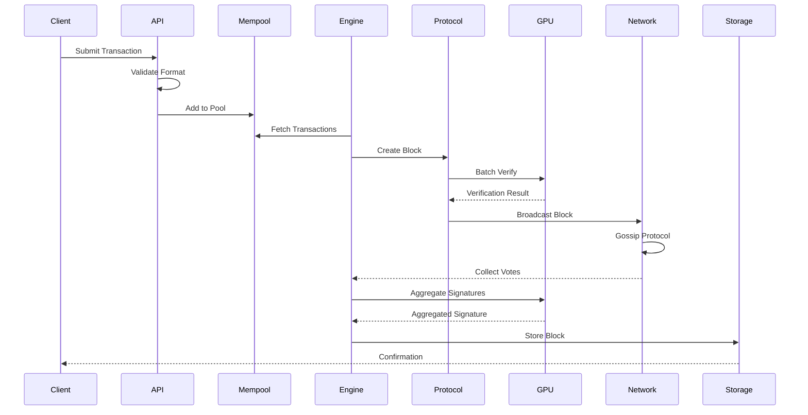
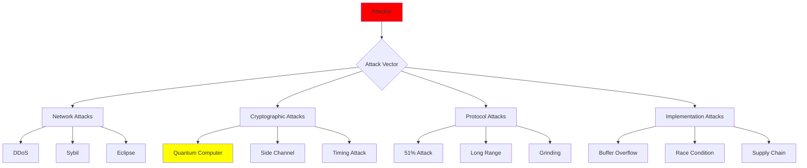

# System Architecture

## Overview

Lux Consensus employs a modular, layered architecture designed for maximum flexibility, performance, and security. The system is built on several key principles:

- **Modularity**: Each component can be independently upgraded or replaced
- **Extensibility**: New protocols can be added without modifying core systems
- **Performance**: GPU acceleration and parallel processing throughout
- **Security**: Defense-in-depth with quantum-resistant cryptography
- **Interoperability**: Support for multiple chain types and cross-chain communication

## Architectural Layers



## Core Components

### Consensus Engine

The heart of the system, responsible for:

- **Protocol Selection**: Dynamically choosing the optimal consensus protocol
- **State Management**: Maintaining and transitioning the blockchain state
- **Transaction Processing**: Ordering and validating transactions
- **Fork Resolution**: Handling chain reorganizations

```go
type Engine struct {
    protocol    Protocol
    state       *State
    validator   *Validator
    network     Network
    crypto      CryptoProvider
    accelerator Accelerator
}

func (e *Engine) Process(block *Block) (*Certificate, error) {
    // 1. Validate block structure
    if err := e.validator.ValidateBlock(block); err != nil {
        return nil, err
    }
    
    // 2. Run consensus protocol
    votes := e.protocol.GatherVotes(block)
    
    // 3. GPU-accelerated signature verification
    valid := e.accelerator.BatchVerify(votes)
    
    // 4. Achieve quantum finality
    if valid && e.protocol.HasQuorum(votes) {
        cert := e.crypto.CreateQuantumCertificate(block, votes)
        return cert, nil
    }
    
    return nil, ErrNoConsensus
}
```

### Protocol Manager

Manages multiple consensus protocols simultaneously:

- **Protocol Registry**: Maintains available protocols
- **Dynamic Switching**: Switches protocols based on conditions
- **Parameter Tuning**: AI-driven parameter optimization
- **Performance Monitoring**: Tracks protocol metrics

### Cryptographic Module

Provides quantum-resistant cryptographic primitives:

#### Post-Quantum Algorithms

| Algorithm | Purpose | Security Level | Performance |
|-----------|---------|---------------|-------------|
| CRYSTALS-Kyber | Key Exchange | NIST Level 5 | 100μs |
| CRYSTALS-Dilithium | Signatures | NIST Level 5 | 200μs |
| SPHINCS+ | Hash Signatures | NIST Level 5 | 500μs |
| NTRU | Encryption | 256-bit | 150μs |

#### Implementation Example

```rust
use lux_crypto::{QuantumSigner, SecurityLevel};

// Create quantum-resistant signer
let signer = QuantumSigner::new(SecurityLevel::NIST5);

// Sign with lattice-based algorithm
let signature = signer.sign_lattice(&message, &private_key)?;

// Aggregate signatures using BLS
let aggregated = signer.aggregate_bls(&signatures)?;

// Create zero-knowledge proof
let proof = signer.prove_knowledge(&statement, &witness)?;
```

### Acceleration Framework

#### MLX Integration

Native integration with Apple's MLX framework for GPU acceleration:

```python
import mlx.core as mx
from lux_consensus import accelerate

@accelerate.mlx
def batch_verify_signatures(signatures, messages, public_keys):
    """GPU-accelerated signature verification"""
    # Convert to MLX arrays
    sigs = mx.array(signatures)
    msgs = mx.array(messages)
    pks = mx.array(public_keys)
    
    # Parallel verification on GPU
    results = mx.vmap(verify_signature)(sigs, msgs, pks)
    
    # Return verification results
    return results.tolist()
```

#### Performance Metrics

| Operation | CPU | GPU (MLX) | GPU (CUDA) | Speedup |
|-----------|-----|-----------|------------|---------|
| Signature Verification | 1ms | 0.04ms | 0.03ms | 25-33x |
| BLS Aggregation | 5ms | 0.2ms | 0.15ms | 25-33x |
| Merkle Root | 2ms | 0.08ms | 0.06ms | 25-33x |
| VRF Evaluation | 3ms | 0.12ms | 0.09ms | 25-33x |

### Network Architecture

#### P2P Network Topology



#### Network Protocols

- **Gossip Protocol**: Efficient message propagation
- **Kademlia DHT**: Distributed peer discovery
- **QUIC Transport**: Low-latency, encrypted connections
- **LibP2P**: Modular networking stack

### Storage Architecture

#### Hierarchical Storage

```yaml
storage:
  hot:
    type: memory
    size: 32GB
    ttl: 1hour
    
  warm:
    type: ssd
    size: 2TB
    compression: zstd
    
  cold:
    type: ipfs
    replication: 3
    erasure_coding: true
```

#### Database Schema

```sql
-- Blocks table with quantum certificates
CREATE TABLE blocks (
    height BIGINT PRIMARY KEY,
    hash BYTEA NOT NULL,
    parent_hash BYTEA NOT NULL,
    state_root BYTEA NOT NULL,
    quantum_cert BYTEA NOT NULL,
    timestamp TIMESTAMP NOT NULL,
    INDEX idx_hash (hash),
    INDEX idx_timestamp (timestamp)
);

-- Transactions with post-quantum signatures
CREATE TABLE transactions (
    hash BYTEA PRIMARY KEY,
    block_height BIGINT REFERENCES blocks(height),
    sender BYTEA NOT NULL,
    recipient BYTEA NOT NULL,
    value NUMERIC NOT NULL,
    pq_signature BYTEA NOT NULL,
    INDEX idx_block (block_height),
    INDEX idx_sender (sender)
);
```

## Data Flow

### Transaction Lifecycle



## Security Architecture

### Defense in Depth

Multiple layers of security:

1. **Network Security**
   - DDoS protection
   - Sybil resistance
   - Eclipse attack prevention

2. **Cryptographic Security**
   - Quantum-resistant algorithms
   - Threshold signatures
   - Zero-knowledge proofs

3. **Protocol Security**
   - Byzantine fault tolerance
   - Long-range attack prevention
   - Nothing-at-stake mitigation

4. **Implementation Security**
   - Memory-safe languages (Rust)
   - Formal verification
   - Continuous fuzzing

### Threat Model



## Scalability Solutions

### Horizontal Scaling

- **Sharding**: Data and computation sharding
- **Parallel Chains**: Multiple chains in parallel
- **State Channels**: Off-chain transactions
- **Rollups**: Compression and batching

### Vertical Scaling

- **GPU Acceleration**: 25-30x performance boost
- **SIMD Instructions**: Vectorized operations
- **Memory Pools**: Pre-allocated memory
- **Zero-Copy**: Efficient data handling

## Monitoring and Observability

### Metrics Collection

```yaml
metrics:
  - name: consensus_rounds_total
    type: counter
    help: Total consensus rounds completed
    
  - name: block_processing_time
    type: histogram
    help: Time to process a block
    buckets: [0.01, 0.05, 0.1, 0.5, 1.0]
    
  - name: gpu_utilization
    type: gauge
    help: Current GPU utilization percentage
    
  - name: network_latency
    type: summary
    help: Network latency to peers
```

### Dashboards

Built-in Grafana dashboards for:
- Consensus performance
- Network health
- GPU utilization
- Security events

## Development Philosophy

### Design Principles

1. **Simplicity**: Complex systems built from simple components
2. **Correctness**: Formal verification where possible
3. **Performance**: Optimization without sacrificing safety
4. **Modularity**: Clean interfaces between components
5. **Documentation**: Code as documentation

### Testing Strategy

```bash
# Unit tests for each component
make test-unit

# Integration tests across components  
make test-integration

# Fuzz testing for security
make test-fuzz

# Performance benchmarks
make bench

# Full test suite with coverage
make test-all
```

## Future Architecture

### Planned Enhancements

- **Neural Consensus**: ML-driven consensus decisions
- **Quantum Computing**: Native quantum algorithm support
- **Cross-Chain Bridge**: Universal interoperability
- **Zero-Knowledge VM**: Private smart contracts
- **Decentralized Storage**: Full IPFS integration

### Research Areas

- Homomorphic consensus
- Federated learning integration
- Quantum-classical hybrid protocols
- Self-optimizing networks

## Conclusion

The Lux Consensus architecture represents a new paradigm in blockchain design, combining:
- Quantum resistance for future-proof security
- GPU acceleration for unprecedented performance
- AI integration for intelligent optimization
- Modular design for maximum flexibility

This architecture enables building the next generation of decentralized applications with the performance of centralized systems and the security guarantees needed for the quantum era.