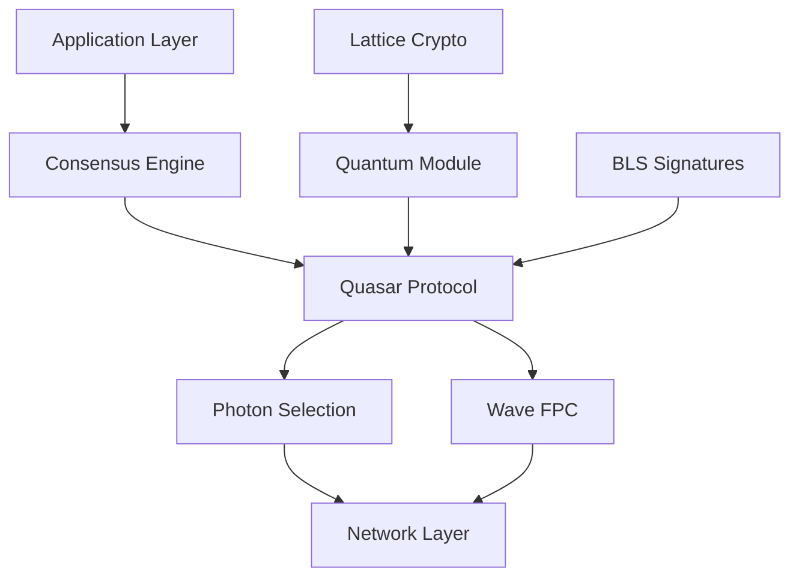

# Lux Consensus

Welcome to the official documentation for Lux Consensus - a quantum-resistant, multi-protocol consensus framework powering the Lux blockchain network.

## 🚀 Quick Start

Get started with Lux Consensus in minutes:

```bash
# Go SDK
go get github.com/luxfi/consensus@latest

# Or use language of choice
pip install lux-consensus      # Python
cargo add lux-consensus         # Rust
npm install @luxfi/consensus    # JavaScript
```

## 📚 Documentation Structure

<div className="grid grid-cols-1 md:grid-cols-2 gap-4 mt-6">
  <Card href="/docs/protocols/quasar">
    <CardTitle>Quasar Protocol</CardTitle>
    <CardDescription>
      Quantum-resistant consensus with 2-round finality
    </CardDescription>
  </Card>
  
  <Card href="/docs/protocols/wave">
    <CardTitle>Wave Protocol</CardTitle>
    <CardDescription>
      Fast Probabilistic Consensus (FPC) implementation
    </CardDescription>
  </Card>
  
  <Card href="/docs/protocols/photon">
    <CardTitle>Photon Selection</CardTitle>
    <CardDescription>
      Performance-based peer selection with luminance tracking
    </CardDescription>
  </Card>
  
  <Card href="/docs/sdk">
    <CardTitle>SDK Reference</CardTitle>
    <CardDescription>
      Multi-language SDKs: Go, C, Rust, Python, C++
    </CardDescription>
  </Card>
</div>

## 🌟 Key Features

### Quantum Finality
Every block achieves post-quantum security through lattice-based cryptography, ensuring your blockchain remains secure against future quantum computers.

### Unified Engine
One consensus engine powers all chain types:
- **DAG chains** (X-Chain)
- **Linear chains** (C-Chain)
- **EVM chains** (C-Chain)
- **MPC chains** (Future)

### Sub-Second Performance
- **< 1 second** finality
- **10,000+ TPS** throughput
- **< 5%** network overhead

### Multi-Language Support
Native SDKs with 100% test parity:
- **Go**: 8.3M blocks/sec
- **C**: 9.2M blocks/sec  
- **Rust**: 7.1M blocks/sec
- **Python**: 6.7M blocks/sec
- **C++**: 12.5M blocks/sec (with MLX)

## 🏗️ Architecture Overview



## 🔬 Consensus Protocols

### [Quasar](/docs/protocols/quasar)
The flagship protocol combining:
- BLS signature aggregation (Round 1)
- Lattice-based signatures (Round 2)
- Zero-leader architecture
- NIST Level 5 quantum security

### [Wave](/docs/protocols/wave)
Fast Probabilistic Consensus featuring:
- Rapid opinion convergence
- Exponentially decreasing randomness
- Adaptive parameters
- Sub-second finality

### [Photon](/docs/protocols/photon)
Light-based peer selection with:
- Luminance tracking (10-1000 lux)
- Performance-weighted sampling
- Dynamic brightness adjustment
- Network health monitoring

### Additional Protocols

- **[Flare](/docs/protocols/flare)**: Conflict resolution for DAG
- **[Horizon](/docs/protocols/horizon)**: Long-range attack prevention
- **[Nova](/docs/protocols/nova)**: Next-generation experimental
- **[Prism](/docs/protocols/prism)**: State sharding protocol

## 💻 Development

### Installation

Choose your preferred language:

<Tabs>
<TabsList>
  <TabsTrigger value="go">Go</TabsTrigger>
  <TabsTrigger value="rust">Rust</TabsTrigger>
  <TabsTrigger value="python">Python</TabsTrigger>
  <TabsTrigger value="c">C</TabsTrigger>
</TabsList>

<TabsContent value="go">
```go
import "github.com/luxfi/consensus"

engine := consensus.New(config)
engine.Start(ctx, genesis)
```
</TabsContent>

<TabsContent value="rust">
```rust
use lux_consensus::Engine;

let engine = Engine::new(config);
engine.start(genesis).await?;
```
</TabsContent>

<TabsContent value="python">
```python
from lux_consensus import Engine

engine = Engine(config)
engine.start(genesis)
```
</TabsContent>

<TabsContent value="c">
```c
#include <lux/consensus.h>

lux_engine_t* engine = lux_engine_new(config);
lux_engine_start(engine, genesis);
```
</TabsContent>
</Tabs>

### Basic Example

```go
package main

import (
    "context"
    "github.com/luxfi/consensus"
    "github.com/luxfi/consensus/config"
)

func main() {
    // Configure consensus
    cfg := config.DefaultParams()
    cfg.QuantumSecurity = true
    cfg.SecurityLevel = 5 // NIST Level 5
    
    // Create engine
    engine := consensus.New(cfg, network, validator)
    
    // Start consensus
    ctx := context.Background()
    if err := engine.Start(ctx, genesis); err != nil {
        panic(err)
    }
    
    // Process blocks
    for block := range blockStream {
        cert := engine.Process(block)
        if cert.IsQuantumFinal() {
            commit(block)
        }
    }
}
```

## 📊 Performance

Latest benchmark results on Apple M1 Max:

| Implementation | Throughput | Latency | Memory |
|---------------|------------|---------|---------|
| C++ (MLX) | 12.5M blocks/s | 0.08μs | 45 MB |
| C | 9.2M blocks/s | 0.11μs | 38 MB |
| Go | 8.3M blocks/s | 0.12μs | 52 MB |
| Rust | 7.1M blocks/s | 0.14μs | 41 MB |
| Python | 6.7M blocks/s | 0.15μs | 68 MB |

## 🛠️ Tools & Utilities

- **[Consensus CLI](/docs/tools/cli)**: Command-line interface
- **[Simulator](/docs/tools/simulator)**: Network simulation
- **[Benchmarker](/docs/tools/benchmark)**: Performance testing
- **[Validator](/docs/tools/validator)**: Node validation tools

## 📖 Guides

- [Getting Started](/docs/guides/getting-started)
- [Running a Validator](/docs/guides/validator)
- [Protocol Configuration](/docs/guides/configuration)
- [Performance Tuning](/docs/guides/tuning)
- [Security Best Practices](/docs/guides/security)

## 🔗 Resources

- [GitHub Repository](https://github.com/luxfi/consensus)
- [Research Papers](/docs/research)
- [API Reference](/docs/api)
- [Change Log](/docs/changelog)
- [Contributing Guide](/docs/contributing)

## 🤝 Community

- [Discord](https://discord.gg/luxfi)
- [Twitter](https://twitter.com/luxfi)
- [Forum](https://forum.lux.network)
- [Stack Overflow](https://stackoverflow.com/questions/tagged/lux-consensus)

## 📄 License

Lux Consensus is open source under the [BSD-3-Clause License](https://github.com/luxfi/consensus/blob/main/LICENSE).

---

<div className="mt-8 p-4 bg-blue-50 dark:bg-blue-950 rounded-lg">
  <p className="text-sm">
    **Need help?** Join our [Discord](https://discord.gg/luxfi) or check out the [FAQ](/docs/faq).
  </p>
</div>