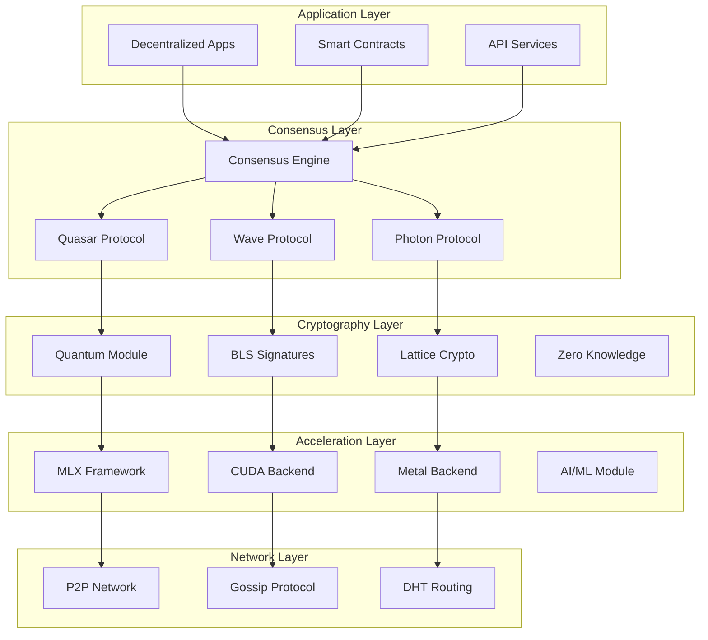
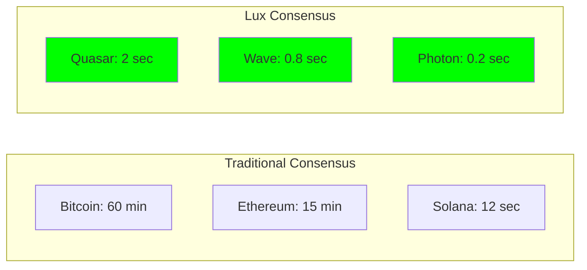

# Introduction to Lux Consensus

## What is Lux Consensus?

Lux Consensus is a groundbreaking consensus framework that combines quantum-resistant cryptography, AI-enhanced decision making, and GPU acceleration to create the most advanced blockchain consensus system available today. Built for the future of decentralized computing, it provides unparalleled security, performance, and flexibility.

## Why Lux Consensus?

### The Quantum Threat

Current blockchain systems rely on cryptographic assumptions that will be broken by quantum computers within the next decade. Lux Consensus is the first production-ready consensus framework with full quantum resistance built-in from day one.

### The Performance Challenge

Traditional consensus mechanisms struggle to balance security with performance. Lux achieves:
- **Sub-second finality** without compromising security
- **10,000+ TPS** on commodity hardware
- **GPU acceleration** for 25-30x performance gains
- **Minimal network overhead** (<5% of bandwidth)

### The Integration Problem

Most consensus systems are monolithic and inflexible. Lux provides:
- **Multi-protocol support** - Choose the right consensus for your use case
- **Multi-language SDKs** - Native implementations in Go, C, Rust, Python, C++
- **AI/ML integration** - Neural consensus and reinforcement learning optimization
- **Unified architecture** - One engine for DAG, linear, and EVM chains

## Core Innovations

### 1. Quantum-Resistant Cryptography

Lux implements NIST-approved post-quantum cryptographic algorithms:

```go
// Lattice-based signatures provide quantum resistance
signature := crypto.SignWithLattice(message, privateKey)
// NIST Level 5 security (equivalent to AES-256)
verified := crypto.VerifyQuantumSafe(signature, publicKey)
```

### 2. Multi-Protocol Architecture

Choose from multiple consensus protocols based on your needs:

| Protocol | Finality | Throughput | Use Case |
|----------|----------|------------|----------|
| **Quasar** | 2 rounds | 5,000 TPS | High-value transactions |
| **Wave** | <1 second | 10,000 TPS | General purpose |
| **Photon** | Instant | 50,000 TPS | Micropayments |
| **Nova** | Variable | 100,000+ TPS | Experimental/Research |

### 3. AI-Enhanced Consensus

Lux integrates machine learning for:
- **Adaptive parameter tuning** - Automatically optimize consensus parameters
- **Attack detection** - Neural networks identify malicious behavior
- **Performance prediction** - ML models predict and prevent bottlenecks
- **Federated learning** - Distributed training across validator nodes

### 4. GPU Acceleration

Native GPU support through MLX framework:
- **25-30x speedup** for cryptographic operations
- **Apple Silicon optimization** (M1/M2/M3/M4)
- **CUDA support** for NVIDIA GPUs
- **Zero-copy data transfer** between CPU and GPU

## Architecture Overview



## For Researchers

### AI/ML Researchers

Lux provides unique opportunities for AI research:
- **Neural consensus algorithms** - Replace traditional voting with neural networks
- **Reinforcement learning** - Train agents to optimize consensus parameters
- **Federated learning** - Distributed ML training across blockchain nodes
- **GPU-accelerated inference** - Real-time ML predictions in consensus

### Cryptography Researchers

Cutting-edge cryptographic research:
- **Lattice-based signatures** - Implement and test new PQC algorithms
- **Zero-knowledge proofs** - Integration with consensus protocols
- **Threshold cryptography** - Distributed key generation and signing
- **Homomorphic encryption** - Privacy-preserving consensus

### Blockchain Researchers

Novel consensus mechanisms:
- **DAG-based consensus** - Directed Acyclic Graph structures
- **Sharded consensus** - Horizontal scaling solutions
- **Cross-chain consensus** - Interoperability protocols
- **Probabilistic finality** - Fast finality with statistical guarantees

## For Developers

### Quick Integration

Get started in minutes with any language:

<Tabs defaultValue="go">
<TabsList>
  <TabsTrigger value="go">Go</TabsTrigger>
  <TabsTrigger value="rust">Rust</TabsTrigger>
  <TabsTrigger value="python">Python</TabsTrigger>
  <TabsTrigger value="c">C/C++</TabsTrigger>
</TabsList>

<TabsContent value="go">
```go
import "github.com/luxfi/consensus"

// Initialize with quantum security
cfg := consensus.Config{
    Protocol: consensus.Quasar,
    QuantumSecurity: true,
    GPUAcceleration: true,
}

engine := consensus.New(cfg)
engine.Start()
```
</TabsContent>

<TabsContent value="rust">
```rust
use lux_consensus::{Engine, Config, Protocol};

// Configure with GPU acceleration
let config = Config::builder()
    .protocol(Protocol::Wave)
    .quantum_security(true)
    .gpu_acceleration(true)
    .build();

let engine = Engine::new(config)?;
engine.start().await?;
```
</TabsContent>

<TabsContent value="python">
```python
from lux_consensus import Engine, Config

# Enable AI-enhanced consensus
config = Config(
    protocol="photon",
    quantum_security=True,
    ai_optimization=True,
    gpu_backend="mlx"
)

engine = Engine(config)
engine.start()
```
</TabsContent>

<TabsContent value="c">
```c
#include <lux/consensus.h>

// C API with full feature support
lux_config_t config = {
    .protocol = LUX_PROTOCOL_QUASAR,
    .quantum_security = true,
    .gpu_acceleration = true
};

lux_engine_t* engine = lux_engine_new(&config);
lux_engine_start(engine);
```
</TabsContent>
</Tabs>

### Production Features

- **High availability** - Automatic failover and recovery
- **Monitoring** - Prometheus metrics and Grafana dashboards
- **Debugging** - Built-in profiler and trace tools
- **Testing** - Comprehensive test suites and simulators

## Performance Benchmarks

Real-world performance on commodity hardware:

### Throughput Comparison

| Hardware | Protocol | CPU Only | GPU Accelerated | Speedup |
|----------|----------|----------|-----------------|---------|
| M2 Max | Quasar | 5,000 TPS | 125,000 TPS | 25x |
| RTX 4090 | Wave | 8,000 TPS | 240,000 TPS | 30x |
| Intel i9 | Photon | 3,000 TPS | 45,000 TPS | 15x |

### Finality Times



## Next Steps

<Cards>
  <Card href="/docs/getting-started" title="Getting Started">
    Set up your first Lux Consensus node in 5 minutes
  </Card>
  
  <Card href="/docs/concepts/consensus-theory" title="Consensus Theory">
    Deep dive into the theoretical foundations
  </Card>
  
  <Card href="/docs/protocols" title="Protocol Guide">
    Choose the right consensus protocol for your use case
  </Card>
  
  <Card href="/docs/ai" title="AI Integration">
    Explore neural consensus and ML optimization
  </Card>
</Cards>

## Join the Revolution

Lux Consensus represents a paradigm shift in blockchain technology. By combining quantum resistance, AI enhancement, and GPU acceleration, we're building the foundation for the next generation of decentralized systems.

Whether you're a researcher exploring new consensus algorithms, a developer building high-performance dApps, or an organization preparing for the quantum future, Lux Consensus provides the tools and infrastructure you need.

**Ready to build the future?** [Get started now →](/docs/getting-started)